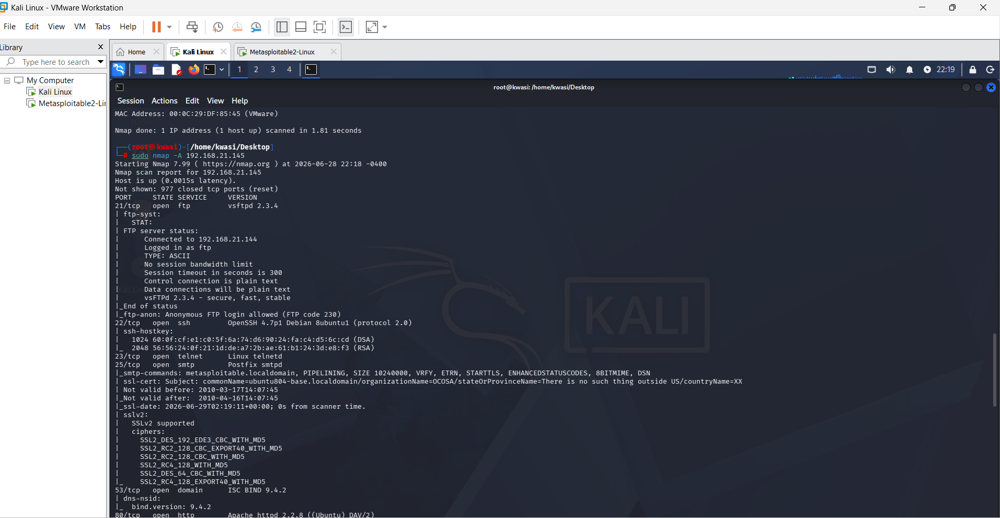
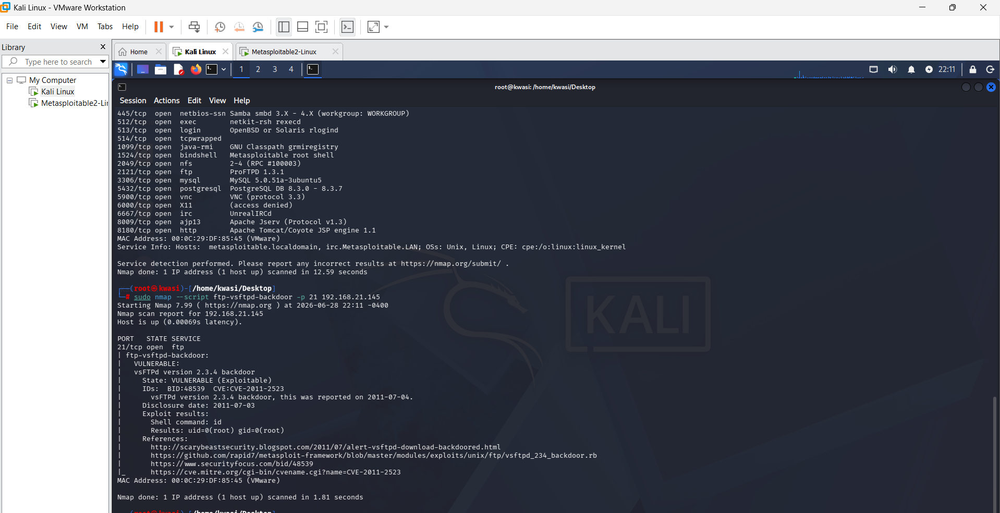
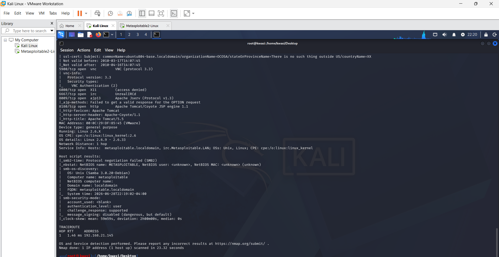

# Security Findings — Metasploitable2 Lab Scan

**Target:** 192.168.21.145 (Metasploitable2 — intentionally vulnerable lab VM)
**Scanner:** Nmap 7.99
**Date:** June 2026
**Tester environment:** Kali Linux (NAT-isolated VMware lab network, owned by tester)

## Methodology

Scans were performed in stages to build a complete picture of the target before drawing conclusions:

1. `nmap -sn` — host discovery
2. `nmap <target>` — default port scan (top 1000 ports)
3. `nmap -sV <target>` — service/version detection
4. `nmap --script ftp-vsftpd-backdoor -p 21 <target>` — targeted vulnerability check
5. `nmap -A <target>` — OS detection, script scanning, traceroute

---

## Finding 1: vsftpd 2.3.4 Backdoor (Critical)

**Affected asset:** Port 21/tcp — vsftpd 2.3.4

**Summary:** The FTP service is running a known-malicious version of vsftpd containing a backdoor that grants unauthenticated root access.

**Severity:** Critical — successful exploitation grants immediate root-level access with no authentication required.

**Technical details:** Nmap version detection identified `vsftpd 2.3.4`. The `ftp-vsftpd-backdoor` NSE script confirmed exploitability, returning `uid=0(root) gid=0(root)` when the backdoor command (`id`) was executed — confirming root-level command execution is possible via the known backdoor, tracked as **CVE-2011-2523**.

**Impact:** An attacker could gain complete control of the host — read/modify/delete any file, install malware, pivot to other systems on the network, or use the host as a launching point for further attacks.

**Recommendation:** Immediately remove or upgrade the vsftpd installation to a version without the backdoor. Verify the integrity of downloaded packages going forward using checksums.

---

## Finding 2: Anonymous FTP Login Allowed (Medium-High)

**Affected asset:** Port 21/tcp — FTP

**Summary:** The FTP service permits anonymous (no-credential) login.

**Severity:** Medium-High — removes the authentication barrier entirely and is often combined with other weaknesses to escalate access further.

**Technical details:** Nmap's `ftp-anon` script confirmed the server returned code 230 (login successful) when connecting with the username "anonymous," meaning no valid credentials were required to gain access.

**Impact:** Depending on configured permissions, an attacker could browse, download, or potentially upload files without valid credentials — useful for reconnaissance, data theft, or planting malicious files if write access is also permitted.

**Recommendation:** Disable anonymous FTP access unless there is a specific, intentional business reason for it. If required, restrict it to a tightly controlled directory with no write access.

---

## Finding 3: SMB Message Signing Disabled (Medium)

**Affected asset:** Ports 139/tcp and 445/tcp — Samba SMB

**Summary:** The SMB service has message signing disabled, leaving file-sharing traffic open to tampering.

**Severity:** Medium — does not grant direct access alone, but weakens the integrity of SMB communications and makes certain man-in-the-middle attacks (e.g. SMB relay) easier for an attacker already on the network.

**Technical details:** Nmap's `smb-security-mode` script reported `message_signing: disabled (dangerous, but default)` — flagged by Nmap itself as a known security risk.

**Impact:** An attacker on the same network could potentially intercept or manipulate SMB traffic, or relay captured authentication attempts to gain unauthorized access to other systems trusting the same credentials.

**Recommendation:** Enable (and ideally require) SMB message signing on all systems where feasible.

---

## Summary table

| # | Finding | Port(s) | Severity |
|---|---------|---------|----------|
| 1 | vsftpd 2.3.4 backdoor (CVE-2011-2523) | 21/tcp | Critical |
| 2 | Anonymous FTP login allowed | 21/tcp | Medium-High |
| 3 | SMB message signing disabled | 139/tcp, 445/tcp | Medium |

---
*Scans performed against a self-owned, isolated lab environment (Metasploitable2) for educational purposes as part of my Security Analyst learning path. No real-world or third-party systems were tested.*
